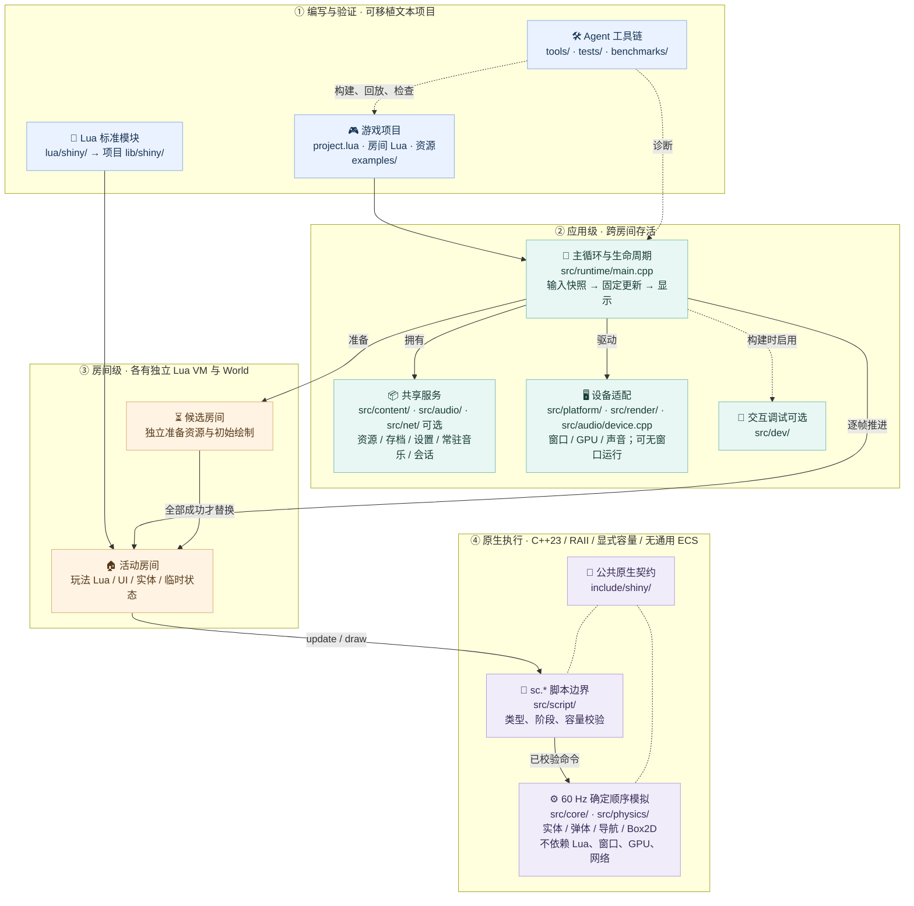

# ShinyCore 架构总览

实线表示拥有、驱动或运行调用；虚线表示离线工具、可选调试或契约关联。房间切换只在候选准备成功后提交；模拟内核不依赖 Lua、窗口、GPU 或网络。核心设计约束是 RAII 与独占所有权、启动时确定容量、固定顺序模拟，不引入通用 ECS。构建裁剪见 [CMakeLists.txt](../CMakeLists.txt)，详细语义见 [架构与契约](architecture.md)。
